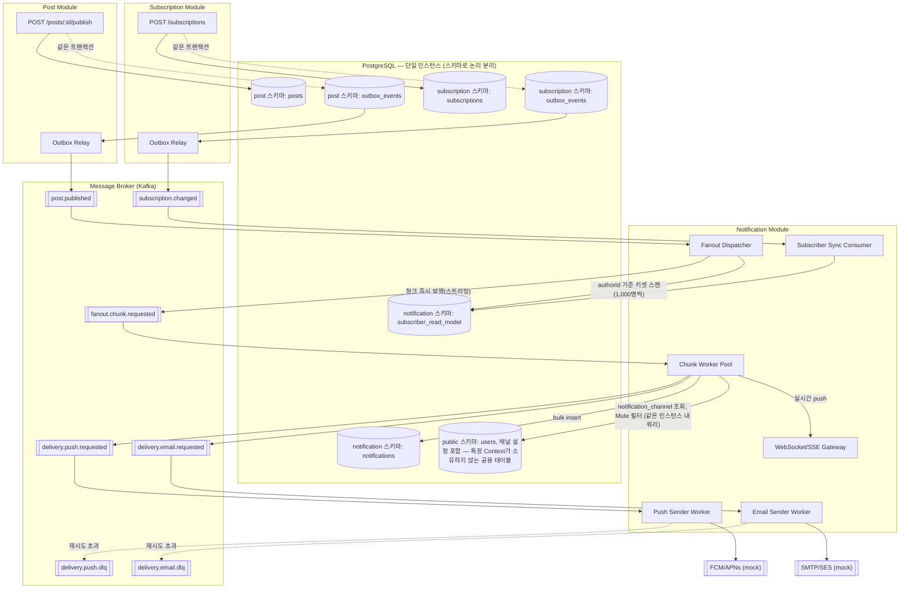
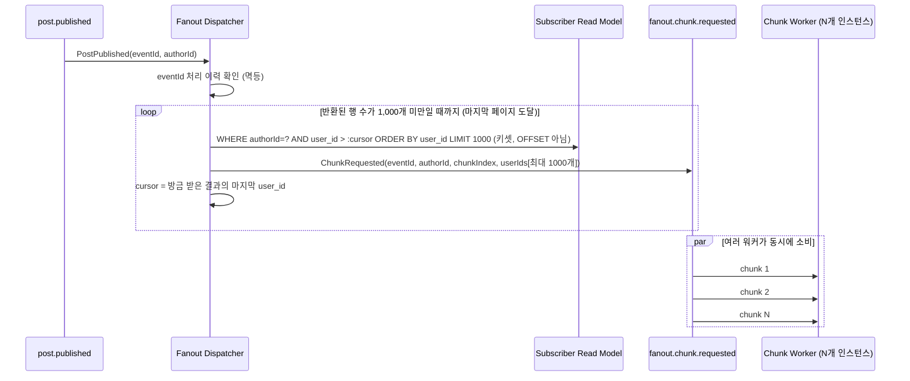

# 아키텍처 설계 — 메시지 브로커 / DB / Fan-out

> [`domain-design.md`](./domain-design.md)에서 정한 Bounded Context 경계와 이벤트 계약(`PostPublished`, `SubscriptionChanged`)을 실제로 어떤 인프라 구성 요소로 구현할지 정한다. 각 결정마다 "왜 이렇게 했는가"를 함께 남긴다 — 특히 NFR-1(5초 이내 10만 팬아웃), NFR-2(장애 격리), NFR-3(핫 파티션/수평 확장)을 기준으로 트레이드오프를 판단한다.

## 0. 이 문서에서 풀어야 하는 핵심 문제

`PostPublished`는 **이벤트 1건**이다. 그런데 그 이벤트 하나가 트리거하는 작업량은 최대 10만 명분의 알림 생성 + 발송이고, 이를 5초 안에 끝내야 한다(NFR-1.1, NFR-1.3 → 최소 20,000 msg/sec).

메시지 브로커의 파티션은 보통 **메시지 단위**로 병렬성을 얻는 장치다. 그런데 `PostPublished` 토픽에 아무리 파티션을 많이 만들어도, 인기 작가 한 명이 글을 발행하는 이벤트는 결국 **파티션 1개, 컨슈머 1개**가 받는다. 그 컨슈머 하나가 10만 건을 순차 처리하면 SLA를 못 지킨다.

→ 그래서 이 문서의 핵심 설계는 **Fan-out을 2단계로 쪼개는 것**이다: (1) "이 작가에게 몇 명이 구독 중인지 보고 N개의 청크 작업으로 쪼개는" 분배 단계, (2) "청크 하나(예: 1,000명)를 실제로 처리하는" 실행 단계. 실행 단계는 여러 컨슈머 인스턴스에 넓게 분산 가능한 별도 토픽으로 만들어서, **이벤트 1건이어도 여러 워커가 동시에 나눠 처리**할 수 있게 만든다.

---

## 1. 전체 아키텍처

- Post/Subscription 모듈은 **자신의 이벤트를 발행할 뿐, Notification의 존재를 모른다** (`domain-design.md` §2와 동일한 원칙) — DB가 물리적으로 한 인스턴스 안에 있다는 사실과 무관하게, 코드에서는 서로의 스키마를 참조하지 않는다.
- 모든 DB 노드는 **하나의 PostgreSQL 인스턴스** 안에 스키마로만 분리돼 있다(`database-design.md` §0). Fan-out이 `users`를 조회하는 화살표(`CHUNK → USERS`)가 예외처럼 보일 수 있지만, 같은 인스턴스 내 쿼리라 네트워크를 타는 서비스 간 호출이 아니다 — `domain-design.md` §2/§6 참고.
- `fanout.chunk.requested`가 이 설계의 핵심 추가 요소다 — 아래 §4에서 자세히 설명한다.

---

## 2. 기술 스택과 선택 근거

| 구성 요소 | 선택 | 근거 |
|---|---|---|
| DB 배포 토폴로지 | 단일 PostgreSQL 인스턴스, Context별 스키마로 논리 분리 | Bounded Context 분리(코드 경계)와 물리 배포는 별개 문제. 인스턴스를 여러 개 운영하는 인프라 복잡도는 불필요하다고 판단, 모듈러 모놀리식으로 시작(`database-design.md` §0). 대신 DB 인스턴스 자체가 공동 장애점(SPOF)이 된다는 트레이드오프는 수용한다(§8 NFR-2 참고). |
| 메시지 브로커 | Kafka | 파티션 기반 컨슈머 그룹으로 수평 확장이 쉽고(NFR-3.2), 처리량 목표(20k msg/sec)에 맞는 처리량/내구성 검증된 선택지. 재시도용 DLQ 토픽 구성도 자연스럽다. |
| Outbox Relay | DB 폴링 또는 CDC(Debezium) | NFR-2.2 — 브로커 장애 시에도 글 등록 트랜잭션은 커밋되어야 하므로, 이벤트 발행을 트랜잭션 밖의 별도 프로세스로 완전히 분리. |
| Notification 저장소 | RDB(쓰기 정합성) + 읽기 캐시(Redis, unread count) | 알림 생성은 멱등성 unique 제약(`domain-design.md` §5.2)이 필요해 RDB가 유리하고, unread count 같은 고빈도 조회는 캐시로 분리해 Read Path를 발송 파이프라인과 격리(NFR-2.3). |
| 실시간 채널 | WebSocket + Redis Pub/Sub(다중 인스턴스 브로드캐스트) | Notification 서버가 여러 인스턴스로 수평 확장될 것이므로, 특정 사용자가 어느 인스턴스에 연결돼 있는지 모른 채로도 이벤트를 전파해야 함. |
| Push/Email 게이트웨이 | 목업 인터페이스(Port) | FR-4.1/4.2, 요구사항 범위상 실연동은 Out of Scope. |

---

## 3. Subscriber Read Model 동기화

`domain-design.md` §5.1에서 정의한 대로, `subscription.changed` 토픽을 컨슈밍해 로컬 테이블을 갱신한다.

- **초기 백필**: 시스템을 처음 띄우는 시점(또는 `subscriber_read_model`을 재구축해야 하는 시점)에는 이벤트가 존재하지 않으므로, `SubscriptionRepository.findSubscribersByAuthor`(`domain-design.md` §4 Repository, `database-design.md` §3.1 `idx_subscriptions_author_active`)로 기존 `subscriptions` 테이블 전체를 커서 기반으로 훑어 1회성 배치 잡으로 채워 넣는다. 이후로는 `subscription.changed` 이벤트만으로 증분 갱신한다.

- **왜 파티션 키 선택이 정합성에 큰 영향을 안 주는가**: `subscriber_read_model`의 한 행은 `(authorId, userId)` 쌍으로 식별된다. 이 쌍에 대한 이벤트(같은 사용자가 같은 작가를 구독→해지)는 `authorId`든 `userId`든 **어느 필드로 파티셔닝해도 값이 고정돼 있어 항상 같은 파티션**에 들어간다 — 즉 파티션 키 선택 자체가 이 쌍의 순서를 보장/파괴하지 않는다. 게다가 컨슈머가 `eventId`가 아니라 `(userId, authorId, occurredAt)` 최신값 기준 **Last-Write-Wins upsert**로 처리하므로(아래), 설령 순서가 뒤바뀌어 도착해도 최종 상태는 항상 올바르게 수렴한다. 따라서 이 토픽은 엄밀히는 파티션 키로 순서를 강제할 필요가 없다.
- **파티션 키: `authorId`(그럼에도 이걸 쓰는 이유)** — 정합성이 아니라 **운영 편의**가 근거다. 한 작가에 대한 모든 구독/해지 이벤트가 한 파티션에 모이면, 장애 조사 시 "이 작가 관련 이벤트만" 순서대로 재생하기 쉽고, `subscriber_read_model` 스캔 패턴(작가 기준)과 파티션 분리 기준이 일치해 로그를 따라가며 디버깅하기 편하다. 대신 극단적으로 인기 있는 작가 하나에 구독/해지가 몰리면 그 파티션에 부하가 쏠릴 수 있는데, 이 토픽은 저빈도(사용자가 구독 버튼을 누르는 빈도)라 `post.published`의 팬아웃 결과물(§7)만큼 위험하지 않다고 보고 감수한다 — NFR-3.3이 실제로 걱정하는 핫 파티션은 이 토픽이 아니라 대량 발행 이벤트 쪽이다.
- 컨슈머는 `upsert(authorId, userId)` / `delete` 형태로 멱등 처리한다 (`eventId` 자체보다 `(userId, authorId, occurredAt)` 최신값 기준 upsert — 재처리돼도 최종 상태는 동일, `database-design.md` §4.1 Last-Write-Wins와 동일한 메커니즘).

---

## 4. Fan-out 설계 (핵심)

### 4.1 왜 2단계로 쪼개는가

앞서(§0) 설명한 대로, `PostPublished` 자체는 파티셔닝으로 병렬화할 수 없는 이벤트 1건이다. 이를 해결하기 위해 팬아웃을 **분배(Dispatch)**와 **실행(Chunk Worker)** 두 역할로 나눈다.

- **Dispatcher**: `post.published`를 받아 `Subscriber Read Model`을 `user_id` 오름차순으로 **키셋 방식으로 끝까지 순차 스캔**하면서, 1,000명씩 모일 때마다 그 `user_id` 목록 자체를 담아 즉시 `fanout.chunk.requested`에 발행한다(스트리밍). "총 인원을 미리 세고 경계값을 계산해서 나눠주는" 방식이 아니다 — 청크 경계값을 미리 알아내려면 결국 `OFFSET`이 필요한데, 이는 `database-design.md` §5의 "OFFSET 배제" 원칙과 충돌하기 때문이다. 대신 Dispatcher는 항상 "마지막으로 본 `user_id` 다음부터 1,000개"만 키셋으로 조회하므로 몇 번째 청크든 조회 비용이 동일하다. 실제 알림 생성/발송은 하지 않는다 — 무거운 작업은 Chunk Worker에게 넘긴다.
  - **종료 조건**: 반환된 행이 1,000개 미만이면 그 페이지가 마지막이라고 판단해 멈춘다. 구독자 수가 청크 크기의 정확한 배수(예: 정확히 100,000명)인 경우 마지막 조회도 1,000개를 꽉 채워 반환하므로, 이 규칙만으로는 종료를 확정할 수 없다 — 이럴 땐 그다음 조회(0개 반환)까지 한 번 더 실행해 빈 결과를 받아야 확실히 끝났다고 판단한다. 흔치 않은 경계 케이스지만, 조회 1번의 비용이 매우 저렴하므로(인덱스 point lookup 수준) 감수한다.
- **Chunk Worker**: `fanout.chunk.requested`를 소비한다. 페이로드에 이미 `user_id` 목록이 들어있으므로 `Subscriber Read Model`을 다시 조회할 필요가 없다 → 공유 `users` 테이블에서 `notification_channel` 조회(Mute 필터) → `Notification` bulk insert → `DeliveryAttempt` 생성 → 채널별 발송 요청 토픽에 적재까지 수행한다.

이렇게 나누면 **인기 작가 한 명의 팬아웃도 여러 워커 인스턴스에 걸쳐 병렬 처리**된다. Dispatcher의 스캔은 순차적이지만(§4.2에서 이 시간도 SLA 예산에 반영한다), 청크 1개를 다 채우는 즉시 바로 발행하므로 **워커들은 Dispatcher가 전체 스캔을 끝내길 기다리지 않고 첫 청크부터 바로 시작**한다(파이프라이닝). `fanout.chunk.requested`는 청크 수가 많으므로(10만 명 ÷ 1,000 = 100개 청크) 파티션도 넉넉히(예: 32개) 두고 컨슈머 그룹을 수평 확장하면 된다 — 이게 NFR-3.3(핫 파티션 대응)의 실제 해결책이다: **원본 이벤트가 아니라 그 이벤트에서 파생된 작업 단위를 파티셔닝 대상으로 만든다.**

### 4.2 청크 크기와 워커 동시성 산정 (NFR-1.3 근거)

- 목표: 100,000건 / 5초 = 20,000 msg/sec 이상.
- 청크 크기 1,000명 기준 → 100개 청크. 청크 하나 처리(DB 조회 + bulk insert + 메시지 발행)를 500ms 안에 끝낸다고 가정하면, 청크 1개당 처리량은 2,000 msg/sec.
- 20,000 msg/sec를 채우려면 **산술적으로 최소 10개 워커**가 필요하다 (2,000 × 10 = 20,000). 워커는 Stateless Consumer이므로 Consumer Group 인스턴스를 늘리는 것만으로 수평 확장 가능(NFR-3.2).
- 청크 크기를 너무 작게 잡으면(예: 100명) 청크 수가 늘어 오버헤드(메시지 발행/컨슈밍 자체의 고정 비용)가 커지고, 너무 크게 잡으면(예: 10,000명) 한 청크 처리 지연이 길어져 마지막 청크가 5초 SLA를 넘길 위험이 커진다. 1,000명 단위는 이 둘 사이의 절충값이며, 실제 값은 `NFR-1.4` 부하 테스트로 튜닝한다.

**여유(margin) 없음에 대한 주의**: 위 계산(100청크 ÷ 10워커 × 500ms = 정확히 5,000ms)은 청크 처리 시간만 반영한 이론치이고, Dispatcher의 키셋 스캔 시간(§4.1 — 100개 청크를 순차로 조회/발행하는 시간, 인덱스 스캔이라 청크당 수 ms~수십 ms 수준으로 추정되나 실측 필요), `post.published`가 Dispatcher까지 전파되는 지연, 브로커 발행/컨슈밍 ack 지연은 전혀 포함하지 않았다 — 다만 Dispatcher 스캔은 워커 처리와 파이프라이닝되므로(§4.1) 전체 스캔 시간이 그대로 더해지는 건 아니고, 대략 "첫 청크 발행까지의 지연 + 마지막 청크가 워커에 도착하는 시점까지의 차이" 정도가 추가된다. 그럼에도 위 계산이 SLA를 정확히 경계에서 채우거나 이미 넘긴다는 점은 변하지 않는다. 실제 운영 목표는 **10개가 아니라 15개 워커**(2,000 × 15 = 30,000 msg/sec, 5초 목표 대비 약 50% 여유) 수준으로 잡아 위 부수 지연들을 흡수할 여지를 둔다. 정확한 여유값은 `NFR-1.4` 부하 테스트로 실측해 조정한다.

### 4.3 멱등성 (FR-2.5)

- **Dispatcher — 마킹 시점이 중요하다**: `eventId` 처리 이력을 "시작 시점에 완료로 마킹"하면 안 된다. 스캔 도중 Dispatcher가 크래시하면, 재시도 시 "이미 처리됨"으로 스킵돼 아직 발행 못 한 나머지 구독자가 **영구히 알림을 못 받는다**. 대신 이력 테이블(`eventId PRIMARY KEY, cursor, status`)을 다음과 같이 쓴다:
  1. 처리 시작 시 `status='IN_PROGRESS', cursor=NULL`로 upsert (이미 `status='DONE'`인 행이 있으면 완전히 스킵 — 멱등).
  2. 청크를 하나 발행할 때마다 `cursor`를 방금 발행한 청크의 마지막 `user_id`로 갱신한다.
  3. 스캔이 끝(마지막 페이지, 반환 행 수 < 1,000)에 도달했을 때만 `status='DONE'`으로 갱신한다.
  4. 재시도(리밸런싱, 워커 재시작 등) 시 `status='IN_PROGRESS'`인 행을 발견하면 처음부터 다시 긁지 않고 **저장된 `cursor` 다음부터** 스캔을 재개한다 — 전체 재스캔에 따른 중복 발행을 줄인다(완전히 막지는 못해도 최소화).
- Chunk Worker: `Notification`의 `(recipientId, sourceEventId)` unique 제약(`domain-design.md` §5.2)이 최종 방어선 — 위 재개 로직이 완벽하지 않아 일부 구간이 중복 발행돼도, 청크가 중복 소비되면 insert 시 conflict로 걸러진다(멱등 upsert 또는 `ON CONFLICT DO NOTHING`).
- 즉 **at-least-once 전달 + DB unique 제약 기반 dedup**으로 NFR-4.2를 만족시킨다. Exactly-once를 브로커 레벨에서 보장하려 하지 않는다 — 그 편이 훨씬 단순하고, 성능에도 유리하다.

### 4.4 진행률 추적 (메트릭 기반)

`domain-design.md` §5.4에서 언급한 진행 상태 추적은 DB 테이블이 아니라 **메트릭**으로 구현한다.

- Dispatcher가 청크를 발행할 때마다 `fanout_chunks_dispatched_total{eventId, authorId}` 카운터 증가, 동시에 `fanout_total_count{eventId}` 게이지로 이번 팬아웃의 전체 대상자 수를 기록.
- Chunk Worker가 청크 처리를 완료할 때마다 `fanout_chunks_completed_total{eventId}` 카운터 증가, `fanout_chunk_duration_seconds` 히스토그램으로 청크당 처리 시간 기록.
- `eventId`를 공통 라벨(또는 분산 트레이싱 ID)로 붙여, Dispatcher와 여러 Chunk Worker에 흩어진 메트릭/로그를 하나의 팬아웃 작업으로 상관관계 지어 조회할 수 있게 한다.
- "5초 SLA를 지켰는가"는 `dispatched_total`과 `completed_total`이 같아지는 시점 - `started_at` 타임스탬프(트레이스 시작 시각)로 사후 계산하거나, Grafana 알림 룰로 실시간 모니터링한다.

**DB 테이블(`FanoutProgress`)로 만들지 않은 이유**: 팬아웃 1건당 최대 100개 Chunk Worker가 진행률 행 하나를 동시에 원자적으로 갱신해야 하는데, 이는 곧 **쓰기 경합(hot row)**을 의미한다. NFR-1(5초 내 처리)을 지키기 위한 관측 장치가 오히려 그 SLA를 깎아먹는 역설이 생길 수 있어, 진행률 추적은 워커별로 독립적으로 emit 가능한 메트릭 시스템(Prometheus 등)에 맡기고 DB에는 상태를 두지 않는다.

---

## 5. Delivery 파이프라인 (Push/Email)

- Chunk Worker는 `DeliveryAttempt`를 만든 후, 채널별로 **별도 토픽**(`delivery.push.requested`, `delivery.email.requested`)에 발행한다.
- **파티션 키: 랜덤(또는 `notificationId`)** — `authorId`나 `userId`로 파티셔닝하지 않는다. 인기 작가 팬아웃 시 특정 파티션에 메시지가 몰리는 핫 파티션을 피하기 위해, 발송 요청은 순서를 보장할 필요가 없으므로 넓게 분산시키는 것이 유리하다.
- 채널이 토픽 자체로 분리되어 있어 **FR-3.4(한 채널 장애가 다른 채널에 영향 없음)**가 인프라 레벨에서 보장된다 — Email 게이트웨이가 느려져도 Push 컨슈머 그룹은 영향받지 않는다.
- 재시도: Exponential backoff(예: 1s, 2s, 4s, 최대 3회) 후 실패하면 `DeliveryAttempt.status = DeadLetter`로 전이하고 DLQ 토픽에 적재(FR-4.3, 4.4). DLQ는 별도 모니터링 대상(NFR-4.1).
- 백프레셔(NFR-3.4): 발송 워커는 다운스트림(FCM/SES) Rate Limit에 맞춰 토큰 버킷으로 소비 속도를 제한한다 — 큐 적체(consumer lag)는 허용하되, 다운스트림 과부하는 허용하지 않는다는 원칙.

---

## 6. 실시간 알림 (WebSocket/SSE)

- Chunk Worker가 `Notification`을 생성하는 시점에, 해당 사용자가 현재 접속 중이면 즉시 push한다(FR-5.4). 접속 여부/소켓 위치는 Notification 서버 인스턴스가 여러 대이므로 Redis Pub/Sub으로 브로드캐스트해 "어느 인스턴스가 그 사용자의 소켓을 들고 있든" 전달되게 한다.
- **5초 SLA(NFR-1.1) 크리티컬 패스에는 포함되지 않는다**: SLA는 "레코드 생성 + 발송 큐 적재"까지만 기준으로 삼는다(NFR-1.2). WS/Redis Pub/Sub 발행은 `Notification` bulk insert 이후 fire-and-forget으로 트리거되고, 그 결과(전달 성공/실패, 지연)를 기다리지 않는다 — Push/Email 게이트웨이 전달과 마찬가지로 Best-effort 비동기로 취급한다.
- 접속이 끊긴 사용자는 재접속 시 `NotificationRepository.findByRecipient` 목록 조회로 따라잡는다(FR-5.5) — 즉 실시간 채널은 Best-effort이고, 목록 조회 API가 **항상 정답(source of truth)**이라는 원칙을 지킨다. 실시간 채널 장애가 나도 알림 자체는 유실되지 않는다(이미 DB에 저장돼 있으므로).

---

## 7. 메시지 브로커 토픽 설계 요약

| 토픽 | 파티션 키 | 파티션 수(예시) | 근거 |
|---|---|---|---|
| `post.published` | `authorId` | 낮음(예: 6) | 저빈도 이벤트. 같은 작가의 연속 발행 순서 보장. 팬아웃 병렬성은 이 토픽이 아니라 §4의 청크 토픽이 담당. |
| `subscription.changed` | `authorId` | 낮음(예: 6) | 같은 작가에 대한 구독/해지 순서 보장 (§3). |
| `fanout.chunk.requested` | 랜덤/round-robin | 높음(예: 32) | 청크 단위 작업을 여러 워커에 최대한 넓게 분산 — 핫 파티션 회피의 실질적 해법(§4.1). |
| `delivery.push.requested` / `delivery.email.requested` | 랜덤/`notificationId` | 높음(예: 32) | 발송 요청은 순서 무관, 인기 작가발 대량 요청을 고르게 분산(§5). |
| `*.dlq` | 원본과 동일 | 낮음 | 실패 건은 재처리 순서보다 완전성이 중요, 저빈도. |

**공통 원칙**: 순서 보장이 필요한 곳(작가 단위 이벤트)만 의미 있는 키로 파티셔닝하고, 순서가 필요 없고 물량이 몰리는 곳(청크/발송 요청)은 일부러 키를 흩어 핫 파티션을 피한다. NFR-3.3을 "인기 작가 = 특정 파티션 과부하"로 좁게 해석하지 않고, **애초에 인기 작가의 대량 작업이 특정 파티션에 몰리지 않도록 파생 토픽의 키 자체를 설계**하는 방식으로 대응한다.

---

## 8. NFR ↔ 설계 매핑

| NFR | 대응 설계 |
|---|---|
| NFR-1 (5초/20k msg/sec) | 2단계 Fan-out(§4), 청크 크기 산정(§4.2), 채널별 토픽 분리(§5) |
| NFR-2 (가용성/장애 격리) | Outbox+Relay(글 등록 트랜잭션과 이벤트 발행 분리), Read Path(unread count 캐시)와 발송 파이프라인 저장소 분리, 채널별 토픽 분리로 장애 격리. **범위 캐벗**: 이 격리는 애플리케이션 프로세스 레벨(NFR-2.1이 명시한 "팬아웃 워커, 발송기, 큐")까지다 — DB는 Post/Subscription/Notification이 하나의 인스턴스를 공유하므로 DB 자체 장애는 공동 장애점(SPOF)이며, 이는 요구사항이 요구하는 격리 범위 밖이라 수용한다(§2 DB 배포 토폴로지 참고). |
| NFR-3 (확장성/핫 파티션) | Stateless Consumer Group 기반 워커, 청크/발송 토픽의 분산 파티션 키(§7), 백프레셔(§5) |
| NFR-4 (관측성/멱등성/정합성/보안) | 팬아웃 진행률 메트릭(§4.4), unique 제약 기반 dedup(§4.3), 읽음 처리 동시성(§8.1), API 인가(§8.2) |

### 8.1 읽음 처리 동시성 (NFR-4.3)

읽음 처리는 별도 락 없이 **단일 원자적 UPDATE**로 처리한다.

- 개별 알림: `UPDATE notifications SET is_read = true, read_at = now() WHERE id = :id AND recipient_id = :recipientId`
- 전체 읽음: `UPDATE notifications SET is_read = true, read_at = now() WHERE recipient_id = :recipientId AND is_read = false`

같은 사용자가 여러 탭/기기에서 동시에 "모두 읽음"을 눌러도, DB의 행 잠금(row lock)이 두 UPDATE를 자연스럽게 직렬화하고 두 번째 실행은 대상 행이 이미 `is_read = true`라 갱신 대상이 0건이 된다 — 결과는 항상 같은 최종 상태로 수렴하므로 애플리케이션 레벨 락이나 낙관적 잠금(버전 컬럼)이 필요 없다. `idx_notifications_unread`(부분 인덱스, `database-design.md` §4.2)가 이 UPDATE의 `WHERE` 절도 그대로 커버한다.

### 8.2 알림 API 인가 (NFR-4.4)

- 인증: 모든 알림 API(목록 조회/읽음 처리/unread count)는 JWT를 요구하고, 미들웨어가 토큰의 `sub` 클레임에서 `recipientId`를 추출한다.
- 인가: `recipientId`는 **항상 토큰에서 추출한 값만 사용**하고, URL 경로나 요청 바디에 담긴 사용자 ID는 신뢰하지 않는다 (IDOR 방지). 모든 조회/갱신 쿼리는 `WHERE recipient_id = :tokenRecipientId` 조건을 반드시 포함한다.
- 서비스 레이어에서도 이 조건이 빠지지 않았는지 재확인하는 것을 코드 리뷰 체크리스트로 둔다 — Repository 메서드 시그니처 자체에 `recipientId`를 필수 인자로 강제해 "조건 누락"을 컴파일/타입 레벨에서 방지하는 것을 권장.

---

## 9. 다음 단계

- 각 DB 테이블의 실제 DDL/인덱스 전략 → [`database-design.md`](./database-design.md) (`Subscriber Read Model`은 `(authorId, userId)` 복합 인덱스로 청크 스캔 최적화)
- 부하 테스트 시나리오 설계 (`docs/load-test-report.md`) — §4.2의 청크 크기/워커 수 가정을 실측으로 검증
- 장애 주입 테스트 시나리오 (`docs/chaos-test-report.md`) — 팬아웃 워커 강제 종료 후 글 등록 API 정상 동작 확인, 브로커 장애 시 Outbox Relay 재시도 확인
