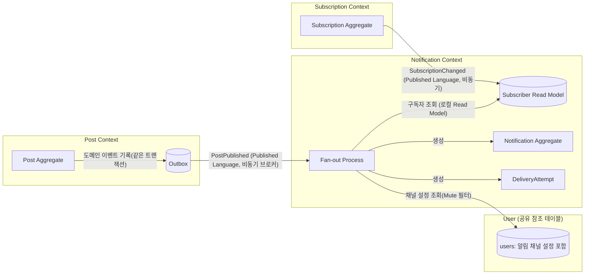

# 도메인 설계 — Bounded Context

> [`requirements.md`](./requirements.md)의 FR/NFR을 기반으로 도메인을 3개의 Bounded Context로 분리한다. 각 Context는 독립된 라이프사이클과 논리적으로 분리된 데이터 저장소(스키마)를 가지며, 나중에 서로 다른 팀/서비스가 소유할 수 있다는 가정 하에 설계한다 — 단, 이는 코드/모듈 경계에 대한 가정이지 물리 배포 토폴로지에 대한 가정은 아니다. 실제 구현은 단일 레포/단일 DB 인스턴스의 모놀리식으로 시작하고, 모듈 경계(스키마 경계)만 Context 경계와 일치시킨다 (`database-design.md` §0). 이렇게 해두면 나중에 특정 Context의 부하가 커졌을 때 그 스키마만 별도 서비스/DB로 분리해낼 수 있다.

## 1. Context 분리 기준

| Context | 책임 | 변경 이유 (Reason to change) |
|---|---|---|
| **Post Context** | 글 작성/발행, 발행 이벤트 발신 | 에디터 기능, 발행 정책 변경 |
| **Subscription Context** | 구독 관계 관리 | 구독 모델(팔로우/유료구독 등) 변경 |
| **Notification Context** | 수신 설정, 팬아웃, 발송, 인앱 알림 조회/읽음 | 알림 채널 추가, 발송 정책/재시도 전략 변경 |

세 Context는 서로 **다른 이유로 변경**되고, **다른 확장 요구**(Post는 쓰기 안정성, Notification은 순간 처리량)를 가지므로 분리한다. 이는 NFR-2(High Availability)의 핵심 근거이기도 하다 — Notification Context 장애가 Post Context에 전파되지 않아야 한다.

## 2. Context Map



- **Post → Notification**: Publisher/Subscriber (비동기 이벤트, Published Language = `PostPublished`). Post Context는 Notification Context의 존재를 몰라도 된다 (완전 비결합).
- **Subscription → Notification**: 마찬가지로 비동기 이벤트 기반. Notification Context는 Subscription Context의 원본 데이터를 직접 쿼리하지 않고, 이벤트를 구독해 **자신의 Read Model(Subscriber Read Model)을 로컬에 복제**한다 (CQRS/Conformist가 아닌 Customer-Supplier + 자체 캐시).
- Notification Context 내부에서 Fan-out 프로세스가 Subscriber Read Model(구독자)과 `users` 테이블(채널 설정)을 조합해 Notification/DeliveryAttempt를 만든다. `users`는 물리적으로는 같은 DB 인스턴스에 있어 조회 자체는 평범한 쿼리지만, 코드/모듈 경계상 FK 없이 값으로만 참조하는 규율은 그대로 지킨다 (§6).

> **설계 결정: 왜 Fan-out 시점에 Subscription Context를 동기 호출(API)하지 않는가?**
> 10만 명 팬아웃을 5초 안에 끝내야 하는데(NFR-1), 매 팬아웃마다 다른 서비스에 동기 조회를 하면 그 서비스의 가용성/응답시간에 발송 SLA가 종속된다. 대신 Subscription Context가 구독 변경 시 이벤트를 발행하고, Notification Context는 이를 구독해 **자신의 스키마 안에 구독자 목록(Subscriber Read Model)을 미리 복제**해 둔다. 팬아웃은 이 로컬 테이블만 읽으므로 외부 의존성이 없다. 대가는 최종적 일관성(eventual consistency) — 구독 직후 아주 짧은 지연 동안은 팬아웃 대상에서 누락될 수 있음을 감수한다.
>
> **같은 DB 인스턴스인데 왜 그냥 `subscriptions` 테이블을 직접 조회하지 않는가?** (§6의 `users` 조회와 다른 점) 물리적으로 같은 인스턴스라도 Subscription 테이블을 직접 조회하면 Notification의 쿼리 부하가 Subscription 스키마의 쓰기 경로와 같은 자원(커넥션 풀, 락, 캐시)을 두고 경쟁하게 되고, Notification을 나중에 별도 DB로 분리할 때 이 조회 로직을 다시 설계해야 한다. `users` 조회는 저빈도·저부하(청크당 최대 몇천 건 PK 조회)라 이 비용이 무시할 만하지만, `subscriptions` 스캔은 10만 명 규모의 고부하 조회라 처음부터 로컬 복제로 분리해두는 편이 안전하다는 판단이다.

---

## 3. Post Context

### Ubiquitous Language
- **Post**: 작가가 작성한 글. `Draft`(초안) → `Published`(발행) 상태를 가진다.
- **Publish**: Draft를 Published로 전환하는 행위. 이 순간이 알림 발송의 트리거.

### Aggregate: `Post` (Aggregate Root)
| 필드 | 타입 | 설명 |
|---|---|---|
| postId | PostId (VO) | 식별자 |
| authorId | AuthorId (VO) | 작성자 |
| title | String | 제목 |
| content | String | 본문 |
| status | PostStatus (Draft/Published) | 상태 |
| publishedAt | DateTime? | 발행 시각 |

**불변식(Invariant)**: `publishedAt`은 `status == Published`일 때만 존재. 이미 Published된 글은 재발행 이벤트를 다시 만들지 않는다 (한 Post당 `PostPublished`는 정확히 1회).

**행위**
- `publish()`: 상태를 Published로 전환하고 도메인 이벤트 `PostPublished`를 생성 (Aggregate 내부에서 이벤트를 쌓아두고, 트랜잭션 커밋 시 Outbox에 함께 기록).

### 도메인 이벤트: `PostPublished`
```
PostPublished {
  eventId: UUID          // 멱등성 키로 사용
  postId: PostId
  authorId: AuthorId
  title: String
  publishedAt: DateTime
}
```

### Outbox
`Post` 저장과 `OutboxEvent` 저장을 **같은 트랜잭션**으로 커밋한다 (NFR-2.2). 별도 Relay 프로세스가 Outbox 테이블을 폴링/CDC로 읽어 브로커에 발행 후 상태를 `PUBLISHED_TO_BROKER`로 표시한다.

### Repository
- `PostRepository.save(post)`
- `PostRepository.findById(postId)`

Post Context는 Subscription/Notification Context의 존재를 참조하지 않는다 (import 방향 없음).

---

## 4. Subscription Context

### Ubiquitous Language
- **Subscription**: 구독자(Subscriber)가 작가(Author)를 구독하는 관계.
- **Subscriber / Author**: 이 Context 안에서는 둘 다 `UserId`로만 참조 (User 프로필 자체는 이 Context의 책임이 아님, 별도 User/Account 개념은 범위 밖으로 최소화).

### Aggregate: `Subscription` (Aggregate Root)
| 필드 | 타입 | 설명 |
|---|---|---|
| subscriptionId | SubscriptionId | 식별자 |
| userId | UserId | 구독자 |
| authorId | UserId | 작가 |
| status | SubscriptionStatus (Active/Cancelled) | 상태 |
| subscribedAt | DateTime | 구독 시각 |

**불변식**: `(userId, authorId)` 조합은 유일 (중복 구독 불가). 이 유일성은 `status`와 무관하게 **행 자체**에 대해 강제된다(Cancelled 행도 유일성 검사 대상) — 구독 취소는 레코드를 삭제하지 않고 `status=Cancelled`로 전이하기 때문(이력 보존, FR-1.3의 스냅샷 근거).

**행위**
- `subscribe(userId, authorId)`: 같은 `(userId, authorId)`의 Cancelled 행이 이미 존재하면 **그 행을 재활성화**한다(`status=Active`, `subscribedAt`을 현재 시각으로 갱신, `cancelledAt=null`) — 새 행을 INSERT하지 않는다. 존재하지 않으면 새로 생성한다. (재구독을 단순 INSERT로 구현하면 위 유일성 불변식에 위배되어 실패한다 — 구현 시 반드시 upsert로 처리, `database-design.md` §3.1의 `ON CONFLICT` 예시 참고.)
- `cancel()`: `status=Cancelled`, `cancelledAt`을 현재 시각으로 설정. 이미 Active가 아니면(중복 취소) no-op.

### 도메인 이벤트: `SubscriptionChanged`
```
SubscriptionChanged {
  eventId: UUID
  userId: UserId
  authorId: UserId
  status: Active | Cancelled
  occurredAt: DateTime
}
```
Notification Context가 이 이벤트를 구독해 자신의 Subscriber Read Model을 갱신한다 (§2 설계 결정 참고).

### Repository
- `SubscriptionRepository.save(subscription)`
- `SubscriptionRepository.findSubscribersByAuthor(authorId, cursor, limit)` — 초기 부트스트랩/백필용 벌크 조회 (FR-1.2). 정상 운영 중에는 이 API가 핫패스가 아님 (Fan-out은 로컬 Read Model 사용).

---

## 5. Notification Context

**Subscriber Read Model**(구독자 캐시)과 **Notification/DeliveryAttempt**(알림·발송 이력) 두 하위 모델로 나눈다. 알림 수신 설정(Push/Email/Mute)은 별도 Aggregate를 두지 않고 §6의 공유 `users` 테이블에 속성으로 둔다 — 이유는 §6 참고.

### 5.1 Subscriber Read Model (Notification Context 내부 캐시)
Subscription Context의 `SubscriptionChanged` 이벤트를 구독해 유지하는 비정규화 테이블.
| 필드 | 설명 |
|---|---|
| authorId | 조회 키 — 복합 PK 선두 컬럼으로 작가별 스캔 최적화 (Kafka 파티션이나 Postgres `PARTITION BY`가 아님, `database-design.md` §4.1 참고) |
| userId | 구독자 |
| updatedAt | 마지막 동기화 시각 |

Fan-out은 `authorId`로 이 테이블을 청크 단위(FR-2.4)로 스캔한다.

### 5.2 Aggregate: `Notification` (인앱 알림)
| 필드 | 타입 | 설명 |
|---|---|---|
| notificationId | NotificationId | 식별자 |
| recipientId | UserId | 수신자 |
| sourceEventId | UUID | `PostPublished.eventId` — 멱등성 키(FR-2.5) |
| postId / authorId / title | - | 알림 내용 구성 요소 |
| isRead | Boolean | 읽음 여부 |
| createdAt / readAt | DateTime | 시각 |

**불변식**: `(recipientId, sourceEventId)` 유일 — 같은 이벤트로 동일 수신자에게 중복 알림 생성 불가 (멱등성).

**행위**
- `markAsRead()`
- `NotificationList.markAllAsRead(recipientId)` (도메인 서비스 or 애플리케이션 서비스에서 벌크 처리)

### 5.3 Entity: `DeliveryAttempt` (채널별 발송 이력)
`Notification` 1건당 채널(Push/Email)별로 0~N개 생성 (Mute면 0개). 물리 테이블은 `notification_delivery_log`(`database-design.md` §4.3)이다 — Entity 이름이 "시도(Attempt)"인 이유는 재시도 여부를, 테이블 이름이 "로그(log)"인 이유는 채널별 발송 이력이 시간순으로 누적되는 성격을 강조하기 위함이며, 가리키는 데이터는 동일하다.
| 필드 | 타입 | 설명 |
|---|---|---|
| notificationId | FK | 연관 알림 |
| channel | Push \| Email | 채널 |
| status | Pending/Sent/Failed/DeadLetter | 상태 (FR-4.3, 4.4) |
| attemptCount | Int | 재시도 횟수 |
| lastAttemptAt | DateTime | 마지막 시도 시각 |

### 5.4 Fan-out 프로세스 (Application Service, Aggregate 아님)
`PostPublished` 이벤트를 소비하는 애플리케이션 서비스. 이 도메인 문서에서는 하나의 서비스로 추상화해 서술하지만, 실제 구현(`architecture.md` §4)에서는 성능상의 이유로 **Dispatcher**(구독자를 스캔해 청크로 쪼개는 역할)와 **Chunk Worker**(청크 하나를 실제로 처리하는 역할) 두 컴포넌트로 나뉜다. 아래 흐름의 1~2단계는 Dispatcher가, 3~5단계는 Chunk Worker가 맡는다.
1. `eventId` 기준 처리 이력 확인 (재처리 시 멱등 — 이미 처리된 이벤트면 skip).
2. `Subscriber Read Model`에서 `authorId` 기준 구독자를 청크 단위로 스캔.
3. 청크별로 §6의 공유 `users` 테이블에서 `notification_channel` 조회 → `Mute` 제외 (FR-3.3).
4. `Notification` 생성(벌크 insert) + 채널별 `DeliveryAttempt` 생성.
5. `DeliveryAttempt`를 Push/Email 발송 큐에 적재.

> 이 프로세스의 진행 상태(총 대상자 수, 처리된 수, SLA 준수 여부)는 NFR-4.1(관측성) 대응이 필요하지만, 별도 DB 보조 레코드(`FanoutProgress`)로 두지 않는다 — Dispatcher/Chunk Worker가 각자 카운터·타이머 메트릭(청크 분배 수, 청크 처리 완료 수, 처리 소요 시간)을 노출하고 `eventId`를 공통 라벨/트레이스 ID로 붙여 상관관계를 추적한다. DB에 진행 상태 행을 두면 다수 워커가 같은 행을 동시에 갱신하는 쓰기 경합(hot row)이 생겨, 정작 이 관측이 지키려는 5초 SLA(NFR-1)의 발목을 잡을 수 있기 때문. 자세한 내용은 `architecture.md` §4.4 참고.

### Repository / Port
- `NotificationRepository.bulkSave(notifications)`
- `NotificationRepository.findByRecipient(userId, cursor, limit)` (FR-5.1)
- `NotificationRepository.countUnread(userId)` (FR-5.3)
- `DeliveryAttemptRepository.save/updateStatus`
- `UserRepository.findChannelByIds(userIds)` — Fan-out 시 Mute 필터링용 벌크 조회 (§6의 공유 `users` 테이블)
- `PushGatewayPort` / `EmailGatewayPort` — 외부 발송기 인터페이스 (구현은 목업, FR-4.1/4.2)

---

## 6. User (공유 참조 식별자 + 알림 채널 설정)

세 Context 모두 `userId`(구독자/작가/알림 수신자 공통 식별자)를 값으로만 참조한다. 회원가입/프로필 관리는 요구사항 범위 밖(`requirements.md` Out of Scope)이므로, User는 별도의 풍부한 Bounded Context로 만들지 않고 **최소 속성만 가진 공유 참조 테이블**로 둔다.

- 속성: `userId`, `email`, `name`, **`notificationChannel`**(Push \| Email \| Mute — 전역 단일값) 정도의 최소 정보만 가진다.
- Post Context의 `authorId`, Subscription Context의 `userId`/`authorId`, Notification Context의 `userId`(수신자)는 모두 이 User의 식별자를 값으로만 저장한다.
- **왜 알림 채널 설정이 User에 있는가**: 원래는 Notification Context 소유의 별도 Aggregate(`NotificationPreference`, 작가별 예외 포함)로 설계했으나, "특정 작가의 알림을 원치 않으면 구독을 취소하면 된다"는 점에서 작가 단위 예외는 불필요하다고 판단해 제거했다. 남는 것은 **전역 채널 설정 하나**뿐이라, 별도 Aggregate로 두기보다 User 속성으로 흡수하는 편이 더 단순하다. 즉 "이 작가의 알림을 받을지"는 **①구독 여부(Subscription Context) + ②전역 채널 설정(User)** 두 가지 조합만으로 결정된다(FR-3.3).
- **트레이드오프**: `userId`는 Context 간 FK 없이 값으로만 참조한다는 규율(`database-design.md` §0)은 그대로 지키지만, Notification Context의 Fan-out 프로세스는 예외적으로 `users` 테이블을 직접 조회한다. 지금은 Post/Subscription/Notification이 **같은 DB 인스턴스**에 있어 이 조회가 별도 서비스로의 네트워크 호출이 아니므로 가용성 리스크가 크지 않다. 다만 이건 "지금 시점에 한해" 성립하는 판단이다 — 나중에 Notification Context를 별도 서비스/DB로 분리하게 되면, 이 조회는 §2의 `subscriber_read_model`과 마찬가지로 로컬 복제(예: `UserChannelChanged` 류 이벤트를 구독해 자체 캐시 유지)로 다시 설계해야 한다. 지금 그렇게 하지 않는 이유는 전역 채널 설정 하나 때문에 이벤트 파이프라인을 미리 만드는 비용이 그 시점의 실익보다 크다고 판단했기 때문이다.
- User가 별도 Context로 승격되어야 하는 시점: 프로필/인증/권한 등 "왜 변경되는가"의 이유가 늘어날 때 (예: 소셜 로그인 추가, 프로필 편집 기능 추가). 지금은 그런 변경 이유가 없으므로 최소 테이블로 유지한다.

---

## 7. Context 간 통신 요약

| From → To | 방식 | 계약(Published Language) |
|---|---|---|
| Post → Notification | 비동기 이벤트 (Outbox + Broker) | `PostPublished` |
| Subscription → Notification | 비동기 이벤트 | `SubscriptionChanged` |
| Notification 내부 (Fan-out → Push/Email 발송기) | 비동기 큐 | `DeliveryRequested` (per-channel) |
| Notification → 클라이언트(웹/앱) | 실시간 채널(WebSocket/SSE) + 폴백 목록 조회 | `NotificationCreated` (push to connected clients) |

세 Context 모두 **동기 API 호출로 직접 결합되지 않는다** — 이것이 NFR-2(고가용성)를 도메인 설계 레벨에서 보장하는 핵심 장치다.

---

## 8. 다음 단계

- 각 Context의 DB 스키마/파티셔닝 전략 → `docs/architecture.md`
- 메시지 브로커 토픽/파티션 키 설계 (예: `PostPublished`는 `authorId` 기준 파티셔닝 고려 — Hot Partition 이슈, NFR-3.3)
- Fan-out 청크 크기 및 워커 동시성 설계 → NFR-1.3 처리량 목표(20,000 msg/sec)와 연결
